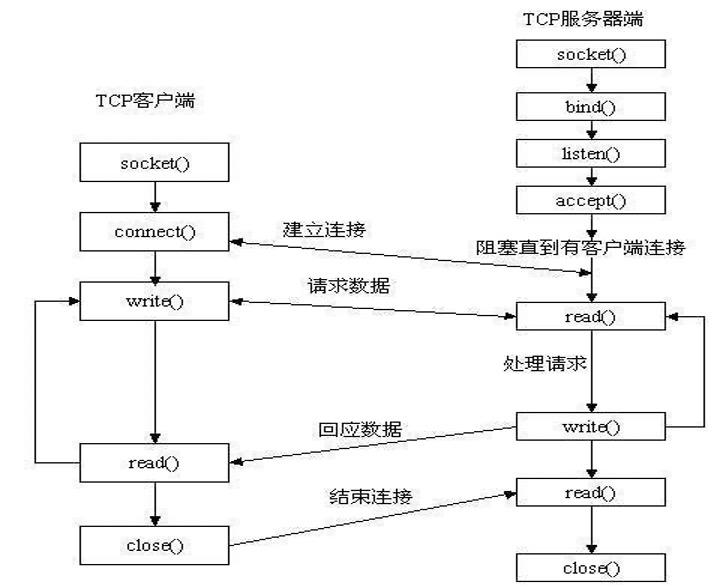
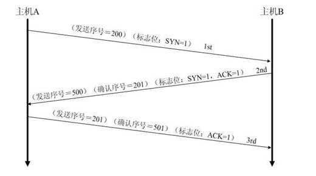
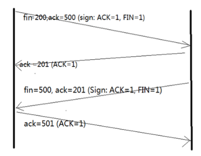

## 关键字 volatile 有什么含义？给出三个不同的例子

关键字`volatile`是防止变量被编译器优化。被`volatile`修饰的变量，编译器不会去假设该变量的值，当优化器每次用到该变量的值时，**都会去变量的原始地址去读取这个变量的值，而不是使用保存在寄存器中的备份值。**

例子：

1. 并行设备的硬件寄存器。
2. 一个中断服务子程序中的非自动变量。
3. 多线程应用中被几个线程任务共享的变量。

---

## 一个参数既可以是 const 还可以是 volatile 吗？解释为什么？

答：可以。一个例子是只读的状态寄存器。它是`volatile`因为它可能被意想不到地改变。它是`const`因为程序不应该试图去修改它。

---

## 一个指针可以是 volatile 吗？解释为什么？

答：可以。尽管这并不常见。一个例子是当一个中断服务子程序修改一个指向 buffer 的指针时。

---

## 关键字 static 的作用是什么？

答：在 C 语言中：

1. 修饰全局变量时，该全局变量只能在本文件内使用。
2. 修饰局部变量时，该变量生命周期延长到程序结束。如果该局部变量没有被初始化，其值默认为 0，若已被初始化，则只能初始化一次。
3. 修饰函数时，该函数只能在本文件中使用。

在 C++中：

1. 被`static`修饰的成员变量在本质上是全局变量，所以需要在类的外部进行定义。
2. 被`static`修饰的成员函数没有`this`指针，可以通过`类名::函数名`进行调用。

---

## static 全局变量与普通的全局变量有什么区别？static 局部变量和普通局部变量有什么区别？static 函数与普通函数有什么区别？

- **static 全局变量**与普通的全局变量有什么区别：`static`修饰的全局变量只初始化一次，且不能在其他文件单元中被引用。
- **static 局部变量**和普通局部变量有什么区别：`static`修饰的局部变量生命周期从程序开始到程序结束，且只被初始化一次，下一次依据上一次结果值。
- **static 函数**与普通函数有什么区别：`static`函数在内存中只有一份，普通函数在每个被调用中维持一份拷贝。

---

## 关键字 const 有什么含意？

1. 可以定义`const`常量。
2. `const`可以修饰函数的参数、返回值，甚至函数的定义体。被`const`修饰的东西都受到强制保护，可以预防意外的变动，能提高程序的健壮性。

---

## 定义一个返回值是指向函数的指针，且有一个指向函数的指针做参数的函数。

```c
typedef int(*P)();
P fun(int (*p)());
```

---

## 找出下面一段 ISR 的问题。

```c
_interrupt double compute_area(double radius)
{
    Double area = PI * radius * radius;
    Printf("\nArea = %f", area);
    Return area;
}
```

答：

1. ISR 不能有参数。
2. ISR 不能有返回值。
3. ISR 应该短且有效率，在 ISR 中做浮点运算不明智。

---

## 评价下面的代码片断：

```c
unsigned int zero = 0;
unsigned int compzero = 0xFFFF; /*1's complement of zero */
```

对于一个`int`型不是 16 位的处理器来说，上面的代码是不正确的。应编写如下：

```c
unsigned int compzero = ~0;
```

---

## typedef 与#define 的区别。

- `#define`在**预编译**的时候做简单的**字符替换处理**。
- `typedef`是在**编译**的时候进行的处理，并不是做简单的字符替换，而是**同定义一个变量一样声明一个数据类型，然后用它去定义这种数据类型的变量。**

---

## Union 与 struct 的区别。（故而常用 struct）

1. 在存储多个成员信息时，编译器会自动给`struct`每个成员分配存储空间，`struct`可以存储多个成员信息，而`Union`每个成员会用同一个存储空间，只能存储最后一个成员的信息。
2. 都是由**多个不同的数据类型成员**组成，但在任何同一时刻，`Union`只存放了一个被先选中的成员，而结构体的所有成员都存在。
3. 对于`Union`的不同成员赋值，将会对其他成员重写，原来成员的值就不存在了，而对于`struct`的不同成员赋值是互不影响的。

---

## 引用和指针有什么区别？

1. 引用必须初始化，指针不必；
2. 引用初始化后不能改变，指针可以被改变；
3. 不存在指向空值的引用，但存在指向空值的指针。

---

## 请说出 const 与#define 相比，有何优点？（故而常用 const）

答：

1. `const`定义的是只读变量，`#define`为宏替换。
2. `const`不会改变变量的存储位置，`#define`定义的宏存储在代码段。
3. `const`常量有数据类型，而宏常量没有数据类型。
4. 编译器可以对前者进行类型安全检查。而对后者只进行字符替换，没有类型安全检查，**并且在字符替换可能会产生意料不到的错误**。

---

## 堆与栈的区别。

- Heap 是堆，Stack 是栈。
  1. **栈的空间由操作系统自动分配和回收**，而堆上的空间由程序员申请和释放。
  2. 栈的空间大小较小，而堆的空间较大。
  3. 栈的地址空间往低地址方向生长，而堆向高地址方向生长。
  4. **栈的存取效率更高**。程序在编译期间对**变量和函数**的内存分配都在栈上，且程序运行过程中**对函数调用中参数的内存**分配也是在栈上。

---

## Linux 环境下段错误出现的原因及调试方法

**出现原因：**

1. 访问不存在的内存地址。
2. 访问系统保护的内存地址。
3. 访问只读的内存地址。
4. 栈溢出。

**段错误调试方法：**

1. 使用`printf`在关键处打印输出信息。
2. 使用`gcc`与`gdb`，编译时使用`gcc -g`命令，然后使用`gdb`进行调试。
3. 使用`core`和`gdb`进行调试。
4. 使用`objdump`进行调试。
5. 使用`catchsegv`。

---

## OSI 七层模型与 TCP/IP 四层模型？

答：

- **OSI 七层模型**：物理层、数据链路层、网络层、传输层、会话层、表示层、应用层。
- **TCP/IP 四层模型**：网络接口层（物理层、数据链路层）、网际层、传输层、表示层（会话层、表示层、应用层）。

---

## OSI 七层的对应各网络协议？

答：

- 物理层：IEEE 802.3（以太网协议）、RJ45
- 数据链路层：HDLC、VLAN、MAC（网桥，交换机）、ARP(属于 TCP/IP 协议族)(在 TCP/IP 四层中属于网络层)
- 网络层：IP、ICMP(互联网控制信息协议)、(ARP、RARP) 工作内容在数据链路层
- 传输层：TCP、UDP
- 会话层：NFS(网络文件系统协议)、SQL、RPC(远程调用协议)
- 表示层：JPEG、MPEG
- 应用层：FTP(文本传输协议)、DNS、Telnet(远程登录协议)、SMTP(简单邮件传输协议)、HTTP(超远文本传输协议)、NFS

---

## 网络四类地址的区间？

网络地址分为网络位和主机位。

- A 类地址：1.0.0.0 --- 127.255.255.255 (127.0.0.1 为回环地址)(ping 通本地回环地址说明本机协议没问题)
- B 类地址：128.0.0.0 --- 191.255.255.255
- C 类地址：192.0.0.0 --- 223.255.255.255
- D 类地址：224.0.0.0 --- 239.255.255.255(广播地址)

---

## 简述 TCP/UDP 服务器端创建流程与客户端创建流程。

> **TCP 服务器端创建流程**：创建通信用文件描述符(socket) → 设置端口号和 IP 地址(为绑定做准备) → 绑定(bind) → 监听(listen) → 接受请求，建立连接(accept) → 发送与接收消息(send/recv) → 关闭文件(close)
>
> **TCP 客户端创建流程**：创建通信用文件描述符(socket) → 设置端口号和 IP 地址 → 发起连接请求(connect) → 接受与发送消息(send/recv) → 关闭文件(close)

> **UDP 服务器端创建流程**：创建通信用文件描述符(socket) → 设置端口号和 IP 地址(为绑定做准备) → 绑定(bind) → 接受和发送消息(sendto && recvfrom) → 关闭文件(close)
>
> **UDP 客户端创建流程**：创建通信用文件描述符(socket) → 设置端口号和 IP 地址 → 接受与发送消息(sendto && recvfrom) → 关闭文件



---

## 简述三次握手与四次挥手。

在 TCP/IP 协议中，TCP 协议提供可靠的连接服务，采用三次握手建立一个连接。

**三次握手的过程：**



1. 第一次握手：建立连接时，客户端发送 SYN(SYN = j)包到服务器，并进入 SYN_SEND 状态，等待服务器的确认；
2. 第二次握手：服务器收到 SYN 包，必须确认客户的 SYN(ACK = j+1)，同时自己也发送一个 SYN 包(SYN=k)，即 SYN+ACK 包，此时服务器进入 SYN_RECV 状态；
3. 第三次握手：客户端收到服务器的 SYN+ACK 包，向服务器发送确认包 ACK(ACK=k+1)，此包发送完毕，客户端和服务器进入 ESTABLISHED 状态，完成三次握手。

**四次挥手的过程(客户端或服务器均可主动发起挥手动作)：**



1. 客户端 A 发送一个 FIN，用来关闭客户 A 到服务器 B 的数据传送。
2. 服务器 B 收到这个 FIN，它发回一个 ACK，确认序号为收到的序号加 1。(和 SYN 一样，一个 FIN 将占用一个序号)。
3. 服务器 B 关闭与客户端 A 的连接，发送一个 FIN 给客户端 A。
4. 客户端 A 发回 ACK 报文确认，并将确认序号设置为收到序号加 1。

---

## TCP 与 UDP 的区别？

1. TCP 是面向连接的协议，UDP 是面向无连接的协议。
2. **TCP 对系统资源要求较多，UDP 对系统资源要求较少**。
3. TCP 是数据流模式，UDP 是数据报模式。
4. TCP 保证数据顺序及数据的正确性，UDP 可能会丢包。

---

## 如果内存已经泄露，该如何检测?

1. 匹配`malloc`和`free`在个数上是否匹配。(`grep -r "malloc" * | wc -l; grep -r "free" * | wc -l`)
2. 使用 Visual Leak Detector 检测工具。

---

## TCP 与 UDP 报头各占几个字节？

- TCP 报头由 10 个必须字段（源端口号 16 位、目标端口号 16 位、序列号 32 位、确认号 32 位、报文长度 4 位、保留位与控制位各 6 位、窗口位 16 位、校验和 16 位、紧急指针 16 位）和一个可选字段，至少 20 个字节构成。
- UDP 由（源端口号、目标端口号、数据报长度、校验值）四部分组成，每个域各占两个字节，故 UDP 报头为 8 个字节。

---

## 定义宏时需要注意什么？

1. 在定义`#define`命令时，注意`<宏名>`和`<字符串>`之间用空格分开，而不是用等号连接。
2. 使用`#define`定义的标识符不是变量，它只用作宏替换，因此不占有内存。
3. **习惯上用大写字母表示`<宏名>`。**
4. 定义宏函数时不能有数据类型。

---

## 面向对象的三大特征

面向对象的三大特征是封装性、继承性和多态性：

- **封装性**：将客观事物抽象成**类**，每个类对自身的数据和方法实行（protection、private、protected、public）。
- **继承性**：广义的继承有三种实现形式：实现继承（使用基类的属性和方法而无需额外编码的能力)、可视继承(子窗体使用父窗体的外观和实现代码)、接口继承(仅使用属性和方法，实现**滞后到子类实现**)。
- **多态性**：是将父类对象设置成为和一个或更多它的子对象相等的技术。用子类对象给父类对象赋值之后，父类对象就可以根据当前赋值给它的子对象的特性**以不同的方式运作**。

说明：面向对象的三个特征是实现面向对象技术的关键，每一个特征的相关技术都非常的复杂，程序员应该多看、多练。

---

## 如何创建守护进程？

只要保证**进程与控制终端完全脱离，此进程就会成为一个守护进程**。

1. 创建子进程，父进程退出 —— 形式上做到与终端无关。
2. 在子进程中创建新会话 —— 与终端完全脱离，使该子进程成为新会话组的组长。
3. 更改当前工作目录为`"/"`或`"/tmp"` —— 增强可移植性，防止其工作目录被删掉。
4. 重设文件权限掩码 —— 增强守护进程创建文件的灵活性。
5. 关闭文件描述符 —— 关闭父进程打开的文件描述符。

---

## 嵌入式系统经常具有要求程序员去访问某特定的内存位置的特点。在某工程中，要求设置一绝对地址为 0x67a9 的整型变量的值为 0xaa66。编译器是一个纯粹的 ANSI C 编译器。写代码去完成这一任务。

答：

```c
int *ptr;
ptr = (int *)(0x67a9);
*ptr = 0xaa66;
```

---

## 请问以下代码有什么问题：

```c
int main()
{
    char a;
    char *str = &a;
    strcpy(str, "hello");
    printf(str);
    return 0;
}
```

答案：没有为`str`分配内存空间，将会发生异常。问题出在将一个字符串复制进一个字符变量指针所指地址。虽然可以正确输出结果，但因为越界进行内存读写而导致程序崩溃。

---

## `char* s="AAA"; printf("%s",s); s[0]='B'; printf("%s",s);` 有什么错？

答案：`"AAA"`是字符串常量。`s`是指针，指向这个字符串常量，所以声明`s`的时候就有问题。应写为：

```c
const char* s = "AAA";
```

然后又因为是常量，所以对`s[0]`的赋值操作是不合法的。

---

## 进程与线程的区别

线程与进程的区别:

1. **调度**：线程作为调度和分配的基本单位，进程作为资源拥有的基本单位。
2. **并发性**：不仅进程之间可以并发执行，同一进程的多个线程之间也可以并发执行。
3. **拥有资源**：进程是拥有资源的独立单位，线程不拥有系统资源，但可以访问隶属于进程的资源。
4. **系统开销**：在创建或撤消进程时，由于系统都要为之分配和回收资源，导致系统的开销明显大于创建或撤消线程时的开销。

---

## 参数传递有几种方式？

解析：传值，传指针或者引用。

---

## 操作系统中**进程调度策略**有哪几种？

解析：这个是操作系统的知识，FCFS(先来先服务)，优先级，时间片轮转，多级反馈。

---

## 发生死锁的必然条件

互斥条件、请求与保持、不可剥夺、循环等待。

---

## C++语言中使用"extern C"有什么作用。

告诉编译器这段代码是用 C 语言编写的，因为 C 语言不支持函数重载，而 C++支持函数重载，编译后的函数名不同。目的是实现 C 语言与 C++语言的**混合编程。**

---

## new delete 与 malloc free 的区别。

1. `malloc`/`free`是库函数，需要加载头文件，`new`/`delete`是运算符，不需要加载头文件。
2. 释放数组内存的时候，`free(数组首地址)`，`delete[] 数组首地址`。
3. `new`申请内存的时候已经确定了数据类型，会有类型检查；`malloc`申请内存的时候并没有数据类型的检查，需要强制类型的转化。
4. `malloc`申请内存的入参是申请内存的字节数，`new`只需要指明数据类型和元素个数。
5. `new`一个对象的时候会自动调用该对象的构造函数，`delete`一个指针的时候，会自动调用该对象的析构函数。而`malloc`/`free`没有这个功能。

---

## 想让程序跳转到绝对地址 0x100000 处执行，该如何做？

```c
(*(void(*)(void))0x100000)();
// 或
((void(*)(void))0x100000)();
```

---

## 内存泄露和内存溢出的区别

- **内存溢出**就是要求分配的内存大小超出了定义时所预设的内存大小，系统不能满足需求，于是产生溢出。
- **内存泄漏**是指向系统申请分配内存进行使用(new)，可是使用完了以后却不归还(delete)，结果你申请到的那块内存你自己也不能再访问（也许你把它的地址给弄丢了），而系统也不能再次将它分配给需要的程序。
